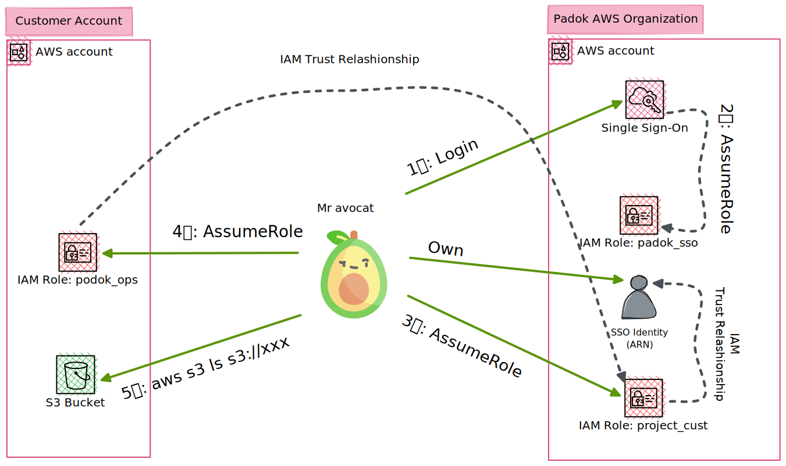
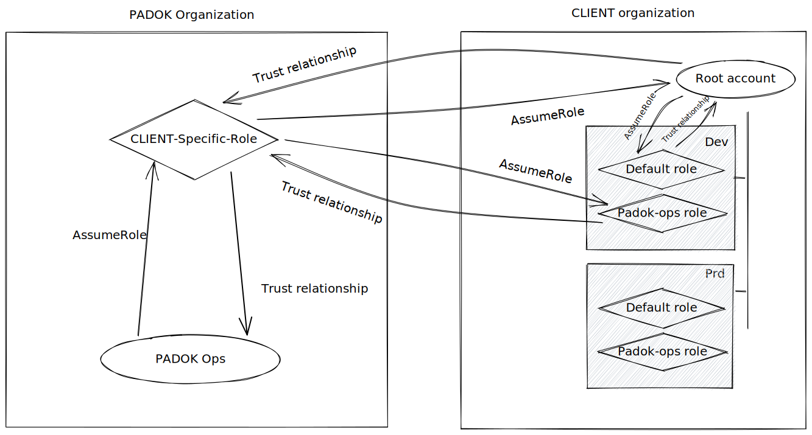

# Bootstrap the AWS Organization for your project

You will find provided in this starter a layer to bootstrap your AWS Organization for your project. It is useful when starting from scratch and your client created only a root account, or did not create anything at all.

## Target IAM Workflow to connect to an account

This schema represente the needs and interactions between Padok AWS Organization and the customer AWS Organization to allow a simple connection through SSO Login.

Note: to edit the schema, upload the svg file to [Excalidraw](https://excalidraw.com/)

### IAM schema during bootstraping

Here is the IAM schema during the bootstraping operation. It represents the different roles and accounts interractions.

Note: to edit the schema, upload the svg file to [Excalidraw](https://excalidraw.com/)

## Prerequisites

A role in the Padok account (766369807176) with rights to AssumeRole. This role should have a Trust Relationship enabling rights to be assumed by members of the project through Padok's SSO.
Ask an admin of the Padok AWS Organization for the role:

- Guillaume L.

You also want to have as much email addresses as needed for the amount of accounts you will create (1 address = 1 account) for your customer. We recommend to ask to your client for these if he is planning to manage the infrastructure by himself someday.

## **Setting up the Root Account**

> Root Account = the AWS account that holds the Organization service

1. (OPTIONAL) Go to [Amazon Web Services](https://aws.amazon.com) and create a new account. This will be the head of your organization.
2. Once the account is created, go to [IAM console](https://us-east-1.console.aws.amazon.com/iamv2/home#/home) to add a new role.
3. Choose **Custom trust policy** on the first page for the **Trusted entity** type section.
4. Use the following json for **Custom trust policy** section.

```json
{
  "Version": "2012-10-17",
  "Statement": [
    {
      "Effect": "Allow",
      "Principal": {
        "AWS": "arn:aws:iam::766369807176:role/project_<CLIENT_NAME>"
      },
      "Action": "sts:AssumeRole"
    }
  ]
}
```

_ℹ️ Don't forget to replace `<CLIENT_NAME>` !_

5. Click **Next** to choose the permission attributed to the role. Select **AdministratorAccess**.
6. Click **Next** and set the role name to: **Padok-Root**.
7. Finally, **Create the role**.

## **Create your project AWS Config file**

We recommend using [`direnv`](https://direnv.net/) to split your AWS (and Kubernetes) configs depending on the projects you are working on. Assuming you will have a separate folder in your computer for your project, here is an example of a `.envrc` file at the root of your project's directory:

```bash
export AWS_SHARED_CREDENTIALS_FILE=/path/to/project/directory/.aws/credentials
export AWS_CONFIG_FILE=/path/to/project/directory/.aws/config
export AWS_PROFILE=default
export KUBECONFIG=/path/to/project/directory/.kube/config
```

This will allow you to have cleaner configuration files across your different projects and usages!

Now that your role in the Root Account is created, you can bootstrap your `.aws/config` file. We highly recommend this way of doing it, allowing chained AssumeRoles through the `source_profile` parameter:

```toml
# Your default profile is supposedly your SSO access to Padok's account.

[default]
sso_start_url = https://d-9c671736e4.awsapps.com/start
sso_region = eu-west-2
sso_account_id = 766369807176
sso_role_name = PadokSSO
region = eu-west-2

# This is the role in Padok's account that gives you access to the project.

[profile project_<CLIENT_NAME>]
role_arn = arn:aws:iam::766369807176:role/project_<CLIENT_NAME>
role_session_name = Padok
region = eu-west-3
source_profile = default

# This is the role for the root account of your project.
# We highly recommend using the same profile name for everyone working on the codebase. This is where direnv comes useful!

[profile root]
role_arn = arn:aws:iam::<ROOT_ACCOUNT_ID>:role/Padok-Ops
role_session_name = Padok
region = <PROJECT_REGION>
source_profile = project_<CLIENT_NAME>
```

_ℹ️ Don't forget to replace variables !_

Ultimately, the only real AWS access you have is through Padok's SSO, and all your other accesses for the project will come from chained AssumeRoles.

## **Setting up your AWS Organization**

Go to `layers/organization/root/` and edit the file `inputs.hcl` to adapt the content of the `context` variable for your usage:

- accounts your want to create
- organizational unit you want
- association of OU with account

Go to `layers/` and edit the file `terragrunt.hcl`. Adapt the `locals` variables for your usage:

- setup the `profile` variable regarding the account your created. Values for profile names are linked with the content of your `config` file for AWS CLI (that is why `direnv` and everyone in the team using the same profile names are so useful).

It's time to deploy. Go back to `layers/organization/root/`, and deploy your organization:

```bash
terragrunt init
terragrunt plan
terragrunt apply
```

**Warning** ⚠️: If for any reason, you created the account in the wrong organization folder, do not delete them ! Instead move them manualy from the AWS console, delete them from the state and finaly import them.


Once finished, your AWS organization and its accounts are created. For now, we can only use the default "root" role created by AWS Organization, so we will have to add our `padok_ops` role on each account.
Use the account IDs outputted by Terragrunt in input of the script `bootstrap/roles.sh` that will create the role `Padok-Ops` in each account.

```bash
bash bootstrap/roles.sh account_1 account_2 account_3 account_4 [...]
```

Our Padok's roles are created. Let's finish our AWS config. Edit your `.aws/config` and use the following template for each of your account:

```toml
[profile <PROFILE_NAME>]
role_arn = arn:aws:iam::<ACCOUNT_ID>:role/Padok-Ops
role_session_name = Padok
region = <PROJECT_REGION>
source_profile = project_<CLIENT_NAME>
```

1. Replace `<PROFILE_NAME>` regarding the profile your defined in `layers/terragrunt.hcl`
2. Use each account ID for `<ACCOUNT_ID>`
3. Change `<PROJECT_REGION>`
4. Replace `<CLIENT_NAME>`

🥳 Now, you can run Terragrunt in each of your infrastructure layers!

## Use `direnv`

We recommand to use `direnv` and create a dedicated AWS config file for your customer, in the root directory of your repo.

Use `direnv` to the `AWS_CONFIG_FILE` variable :

```
export AWS_CONFIG_FILE=${PWD}"/.aws_config_file"
```

(don't forget to run `direnv allow`).

Now when you change to your directory project, you will use the rights AWS credentials.

## Open the AWS Web Console when using Padok role chain

When using the role chaining, you can use the SSO from Padok organization to open a web console on your customer account.

You have to use a small python script that will do the trick for you.

```bash
pip3 install -r scripts/sso_console/requirements.txt
```

To open a web console:

```bash
python3 scripts/sso_console/cli.py
```

Choose the account based on the name you give them in your AWS_CONFIG_FILE.

More about the cli [here](../scripts/sso_console/README.md).

## ⚠️⚠️ You have set a wrong email on one or several of the newly created accounts and want to change it

### You have access to the wrong email you specified

If you set the wrong email and have access to it. You should be able to connect to the child account using the root account and change it using the AWS Console

Follow [this documentation](https://docs.aws.amazon.com/controltower/latest/userguide/change-account-email.html) to learn about the full process.

### You don't have access to the wrong email you specified

That's where the problem starts. There is no clean solution to resolve this problem.

The easiest way is to recreate the AWS account with the right email.

First, clean your AWS Organization and close manually each account you set the wrong email.

⚠️ Don't do this with terraform destroy ! Terraform will tell you to unlink your child aws account from your organization. You don't want to do that.

Go to your AWS Organization in your root account. Select the account you want to close and click on "Close". Do this for each account you want to close

Your child account is now suspended and will be deleted after 90 days.

⚠️ You can only close 10 accounts every 30 days.

Once you have cleaned your organization, you can recreate your accounts with Terraform. If it was a newly created projet, it might be better to delete and recreate a tfstate file.
