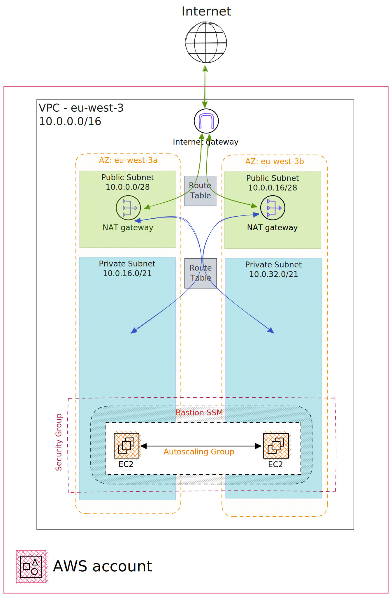

# Deploy classic network staack

## Target Architecture

At the end of the network layers implementation, you will end up with something like this (for 1 VPC):



The starter and current modules don't handle peering between account on different account.

## How to deploy my classic network architecture

Behind the usage of the WYSIWYG pattern, the starter provide an example to deploy the previous architecture presented in the previous diagram for 3 environments, on 3 different accounts.

Default configuration shared between each account are available in the `network/module.hcl` file.

The previous schema shows the dev example.

Specific parameters, like VCP CIDR and Subnets CIDR are set for each environment in the file `network/<env>/inputs.hcl`.

The deploy an environment:

```
cd layers/network/<dev>
terragrunt init
terragrunt apply
```

### Details about SSM Bastion

A SSM Bastion is embeded in the example (through the network module).

Useful to connect to things like an RDS instance or a EKS Cluster.